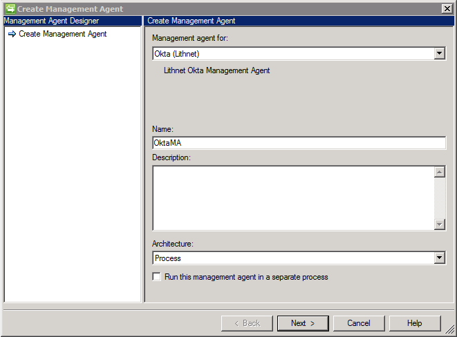
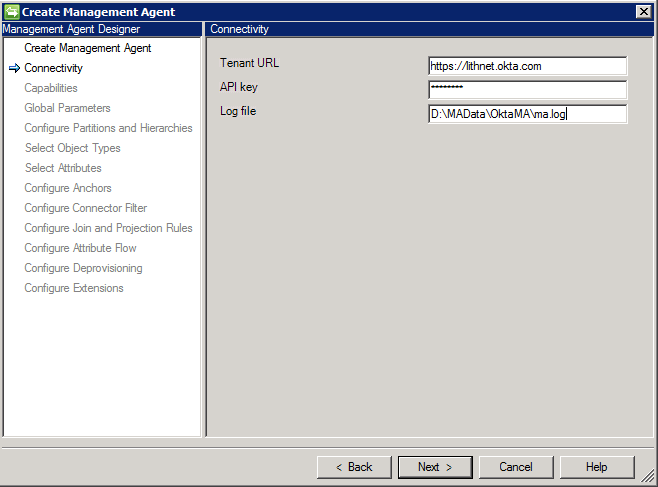
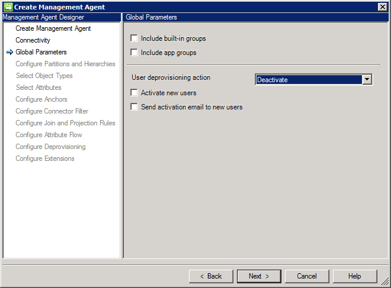
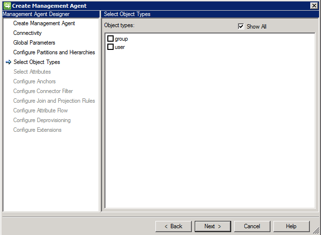

# Installing the OKTA management agent

Download the latest version from the [releases](https://github.com/lithnet/okta-managementagent/releases/) and run the installer on the server that has the FIM synchronization service installed.ls

### Create Management Agent

Once the management agent has been installed, you may need to restart the FIM Synchronization Service Client application if you do not see the `Okta (Lithnet)` management agent type listed.

### Connectivity

| Setting    | Description                                                                                                                                             |
| ---------- | ------------------------------------------------------------------------------------------------------------------------------------------------------- |
| Tenant URL | This is the URL of your Okta domain. Be sure that you DO NOT include the -admin suffix that appears when visiting the admin console of your tenant      |
| API key    | Create an API key using the [guide provided by Okta](https://developer.okta.com/docs/api/getting\_started/getting\_a\_token)                            |
| Log file   | Specify the path to a location where the log file will be created. Ensure that the FIM sync engine service account has access to write to this location |

### Global Parameters

These settings control the behavior of the management agent.

#### Include built-in groups

This will include groups that are built into Okta itself. These groups have a type of `BUILT_IN` within Okta itself.

#### Include app groups

Allows the management agent to import groups with a type of `APP_GROUP`. These are typically created by external applications, such as the Active Directory agent.

The management agent will always import groups of type `OKTA_GROUP` when the `group` object class is selected in the `Select Object Types` page of the management agent configuration.

#### User deprovisioning action

If the management agent is with a deprovisioning action of 'Stage a delete of the object on the next run', you can configure the specific way that objects are deleted.

* _Deactivate_ - Users are deactivated, but not deleted. Deactivated users will not be seen by FIM. Deletes will be confirmed on a delta import. Users must be deleted manually from Okta.
* _Delete_ - Users will be deactivated and then automatically deleted. Deletes will only be confirmed on the next full import.

#### Activate new users

Instructs the management agent to automatically activate the users when they are created in Okta. If this option is not selected, the users are place in a `STAGED` status.

#### Send activation email to new users

When the management agent is configured to activate new users, this setting allows you to specify if Okta should send an activation email to new users.

### Select Object Types

Select the object types that you wish to manage. As API calls are expensive, don't select any object types that you don't need.

Do note, that the group object type is currently read-only.

### Select Attributes

Select the attributes that you wish to manage. It is important to note that

* The `id` attribute is mandatory
* Selecting the `availableFactors` and `enrolledFactors` attributes will slow down your import process. These attributes each require a separate API call, and therefore can add significantly to the total time an import process will take. Consider the use of these attributes carefully.

### Complete the configuration

Configure your attribute flows, filters and join rules as needed.

### Provisioning rules

When provisioning new users, use any unique value as the DN, such as a GUID. The actual value does not matter. This will be replaced by the objectId during the confirming import.
